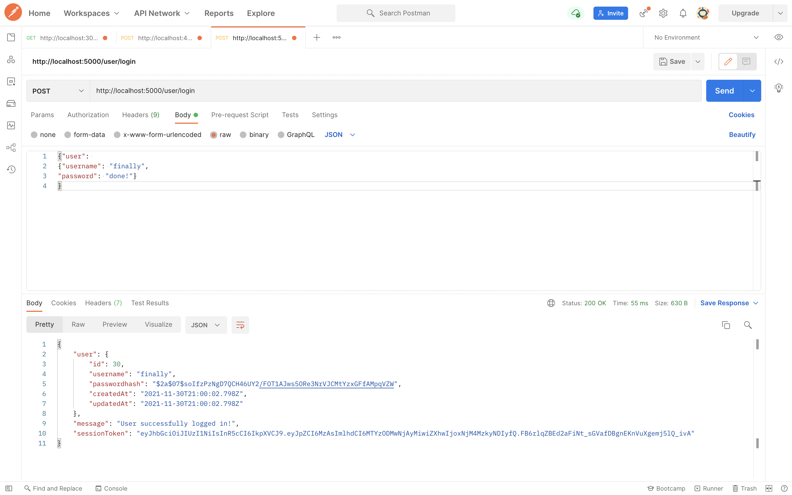
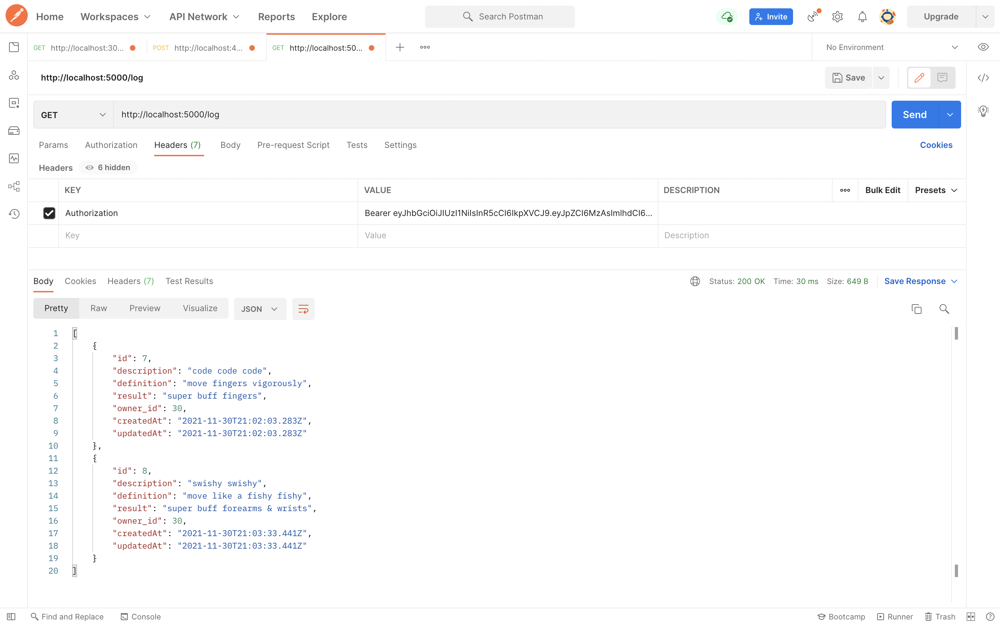
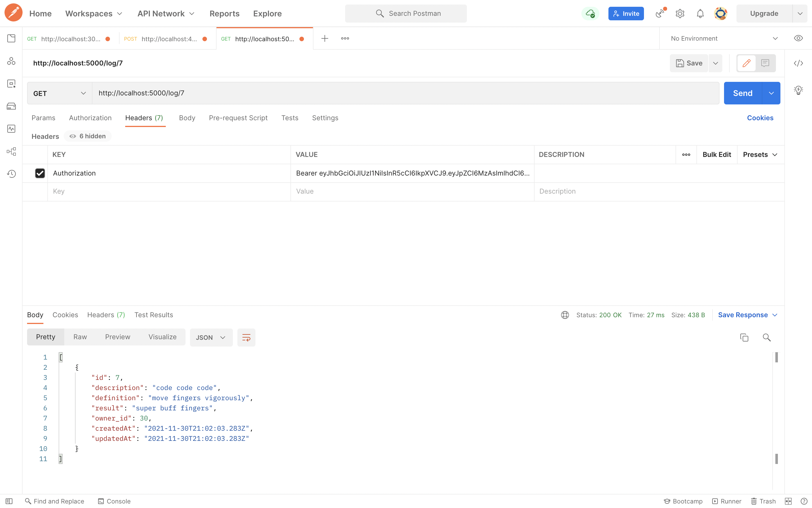
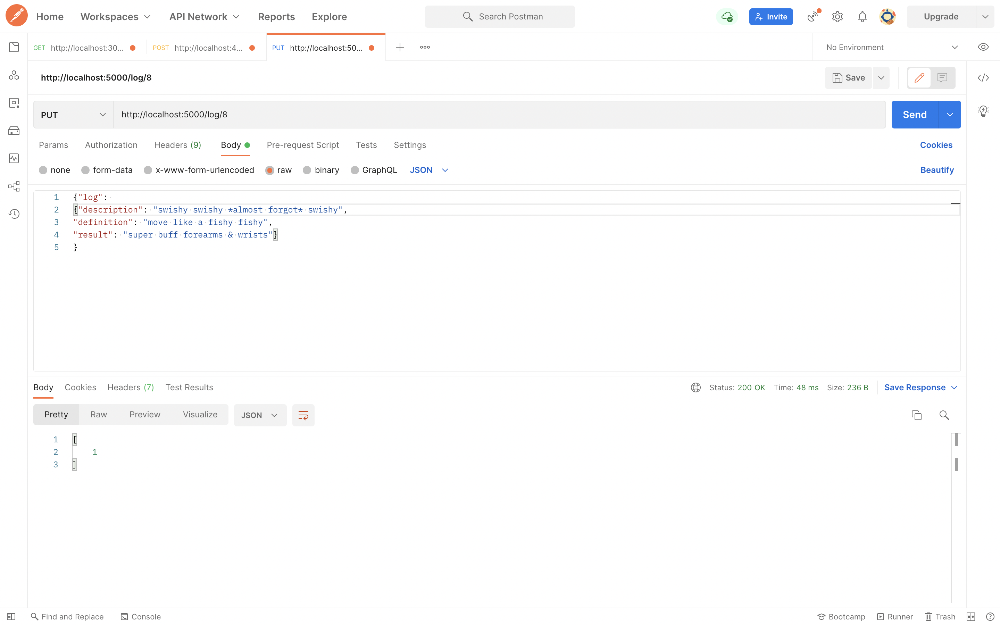
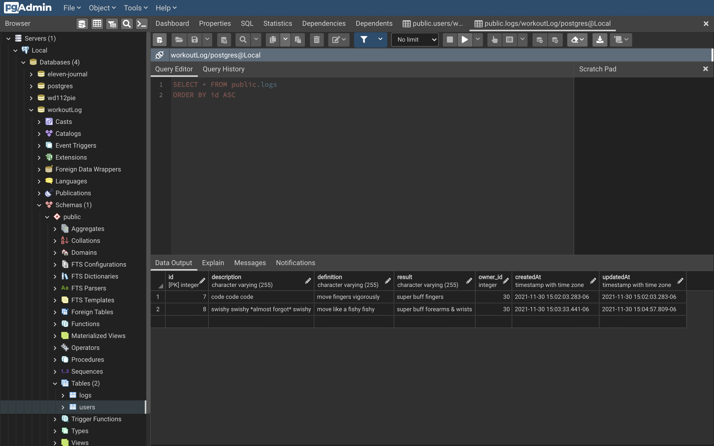
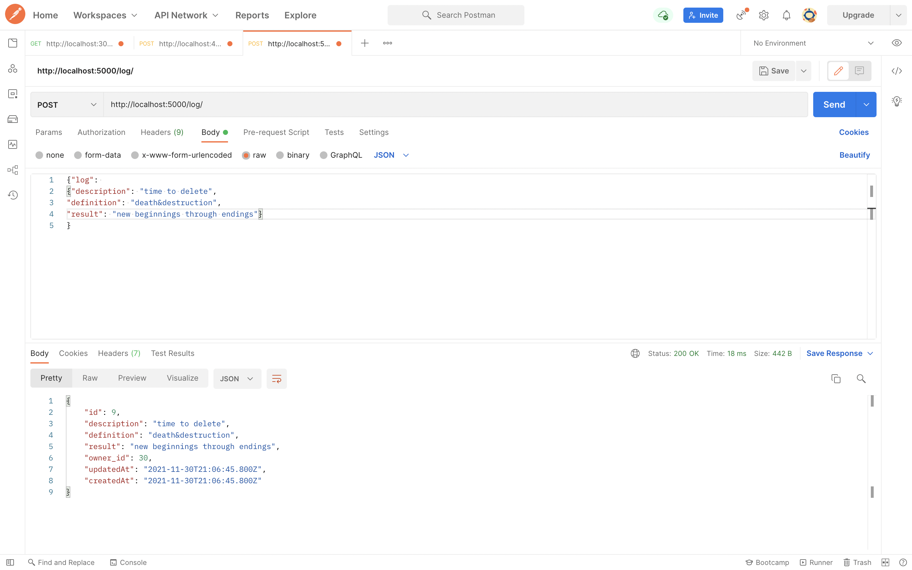
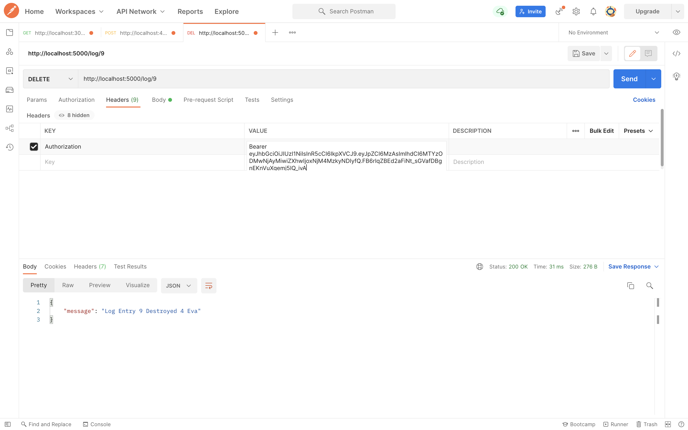

# First Workout Log!

## Images of working postman requests

### Registration

### Login

### Creating a Log

### Log Entry List by Owner

### Log Entry List by Log ID

### Log Entry Update with Successful Update

### Log Entry Delete with Successful Delete

